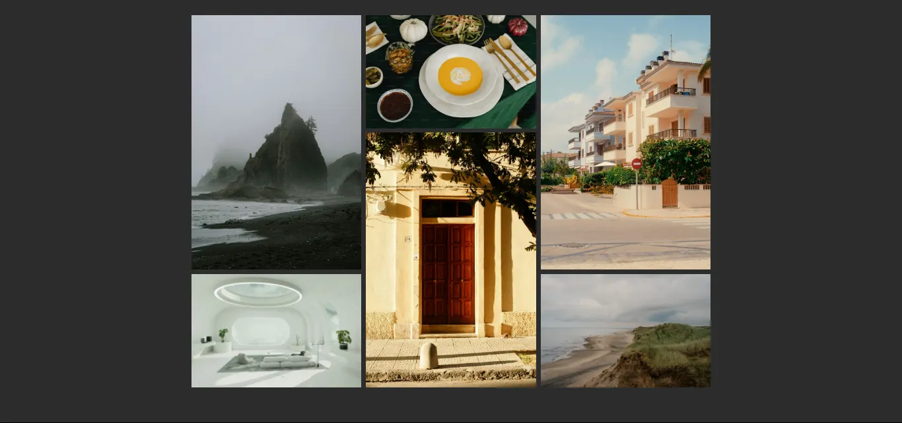

# Roadmap.sh Project Solutions
Project ideas to take you from beginner to advanced in Frontend

## [Frontend Projects](https://roadmap.sh/frontend)

<table>
    <tbody>
        <tr>
            <td>
                
                <h2><a href='https://roadmap.sh/projects/single-page-cv'>Single Page CV</a></h2>
            </td>
            <td>
                
                <h2><a href='https://roadmap.sh/projects/basic-html-website'>Basic Html Website</a></h2>
            </td>
        </tr>
        <tr>
            <td>
                
                <h2><a href='https://roadmap.sh/projects/portfolio-website'>Personal Portfolio</a></h2>
            </td>
            <td>
                
                <h2><a href='https://roadmap.sh/projects/changelog-component'>Changelog Component</a></h2>
            </td>
        </tr>
        <tr>
            <td>
                
                <h2><a href='https://roadmap.sh/projects/testimonial-cards'>Testimonial Cards</a></h2>
            </td>
            <td>
                
                <h2><a href='https://roadmap.sh/projects/datepicker-ui'>Datepicker UI</a></h2>
            </td>
        </tr>
        <tr>
            <td>
                
                <h2><a href='https://roadmap.sh/projects/accessible-form-ui'>Accessible Form UI</a></h2>
            </td>
            <td>
                
                <h2><a href='https://roadmap.sh/projects/image-grid'>Image Grid Layout</a></h2>
            </td>
        </tr>
        <tr>
            <td>
                
                <h2><a href='https://roadmap.sh/projects/tooltip-ui'>Tooltip UI</a></h2>
            </td>
            <td>
                
                <h2><a href='https://roadmap.sh/projects/simple-tabs'>Tabs</a></h2>
            </td>
        </tr>
        <tr>
            <td>
                
                <h2><a href='https://roadmap.sh/projects/cookie-consent'>Cookie Consent</a></h2>
            </td>
            <td>
                
                <h2><a href='https://roadmap.sh/projects/restricted-textarea'>Restricted Textarea</a></h2>
            </td>
        </tr>
        <tr>
            <td>
                
                <h2><a href='https://roadmap.sh/projects/accordion'>Accordion</a></h2>
            </td>
            <td>
                
                <h2><a href='https://roadmap.sh/projects/age-calculator'>Age Calculator</a></h2>
            </td>
        </tr>
        <tr>
            <td>
                
                <h2><a href='https://roadmap.sh/projects/custom-dropdown'>Custom Dropdown</a></h2>
            </td>
            <td>
                
                <h2><a href='https://roadmap.sh/projects/github-random-repo'>GitHub Random Repository</a></h2>
            </td>
            <tr>
            <td>
                
                <h2><a href='https://roadmap.sh/projects/reddit-client'>Reddit Client</a></h2>
            </td>
            <td>
                
                <h2><a href='https://roadmap.sh/projects/task-tracker-js'>Task Tracker</a></h2>
            </td>
            <tr>
                <td>
                
                <h2><a href='https://roadmap.sh/projects/temperature-converter'>Temperature Converter</a></h2>
            </td>
            </tr>
        </tr>
    </tbody>
</table>