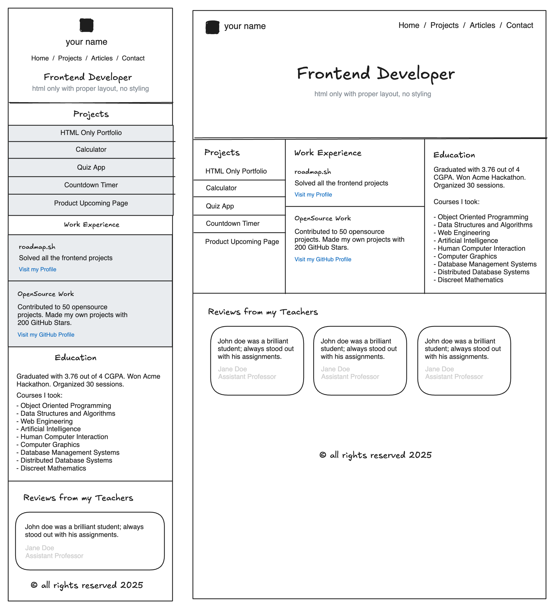

# Personal Portfolio
Convert the previous simple HTML website into a personal portfolio.

> The goal of this project is to teach you how to style a website using CSS. You will take the structure from the previous HTML-only project and apply various CSS techniques to enhance its appearance and responsiveness.

In this project, you will style the HTML website structure you created previously in a different project. The focus will be on learning how to use CSS to create responsive layouts, apply color and typography, and enhance the overall design of your website.

Rough mockups of the website structure for mobile and desctop devices are given below. Do not worry about the design details i.e. colors backgrounds etc at this stage; we are not looking for a beautiful design, but a well-structured and responsive website. Just focus on making the layout same as the mockup and ensuring it looks good on different screen sizes.

## Submission Requirements

Your submission should include:

+ A fully styled, responsive website with the same structure as the previous project.
+ Consistent use of a chosen color scheme and typography.
+ Proper use of CSS techniques like Flexbox, media queries, and the box model.
+ A responsive navigation bar and well-styled contact form.