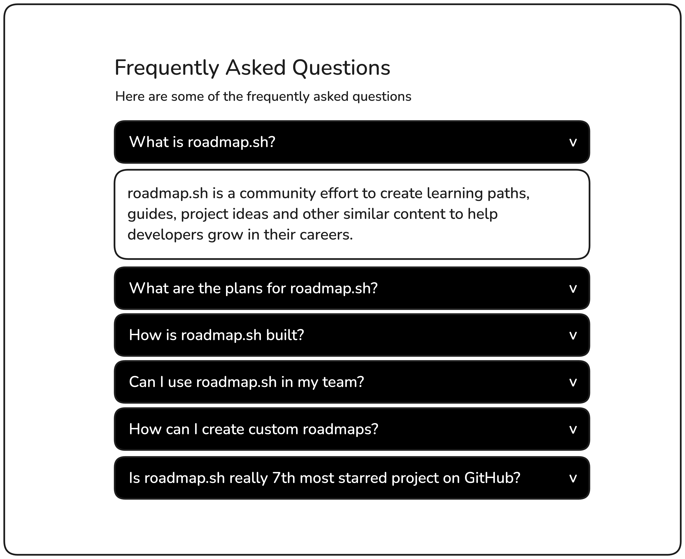

# Accordion
**Create an accordion component using HTML, CSS, and JavaScript.**

You are required to create an accordion component that displays a list of questions or headings. When a user clicks on a question, its corresponding answer or content section will expand while collapsing any previously opened section. This allows only one section to be open at a time, keeping the UI clean and organized.

Given below is the mockup showing the accordion in its default and expanded states:

This project will help you practice DOM manipulation, event handling, and implementing responsive design patterns using JavaScript.