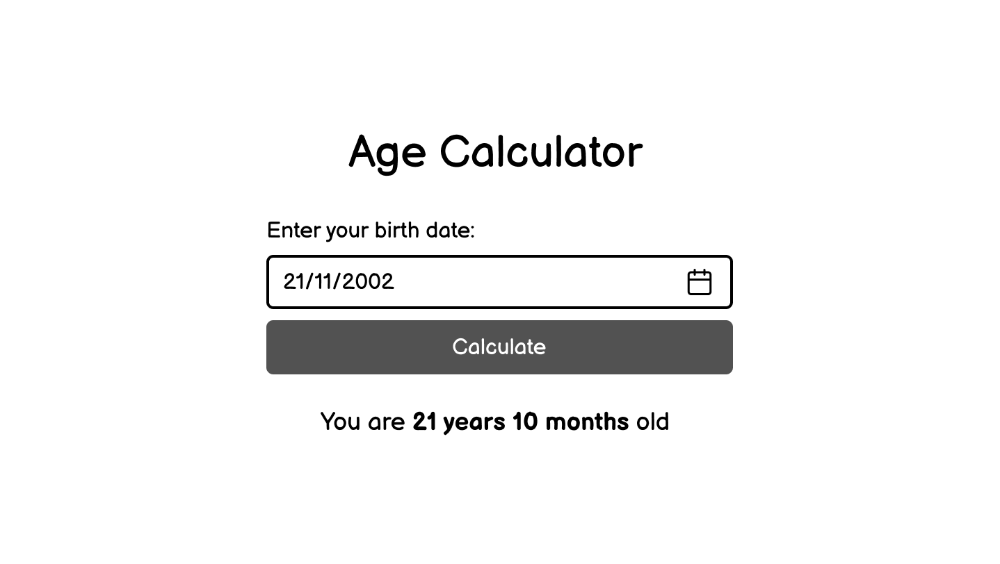

# Age Calculator
###### Create an age calculator using HTML, CSS, and JavaScript.

The goal of this project is to help you learn about how to use external packages using [npm](https://www.npmjs.com/). The user inputs their birthdate via a [JavaScript Datepicker](https://www.npmjs.com/package/js-datepicker), and the app calculates and displays their exact age, including years, and months using [Luxon](https://www.npmjs.com/package/luxon).

## Requirements
You are required to develop an age calculator with the following features:

- A form that allows users to input their birthdate using a JavaScript datepicker (avoid the default HTML date picker)
- Use the [Luxon](https://www.npmjs.com/package/luxon) library to calculate the exact age in years, months, and days
- Display the result on the same page after the user submits the form
- Implement basic validation to ensure the birthdate is valid
- Use simple styling to make the calculator visually appealing and responsive

This project will help you understand how to manipulate dates and times in JavaScript using [Luxon](https://www.npmjs.com/package/luxon). You’ll gain experience handling user input via a datepicker, performing date calculations, and designing a simple user interface.

## Use

If you wanna use this project, you should run the command `npm run dev` and then you must access the link that the CLI will give you