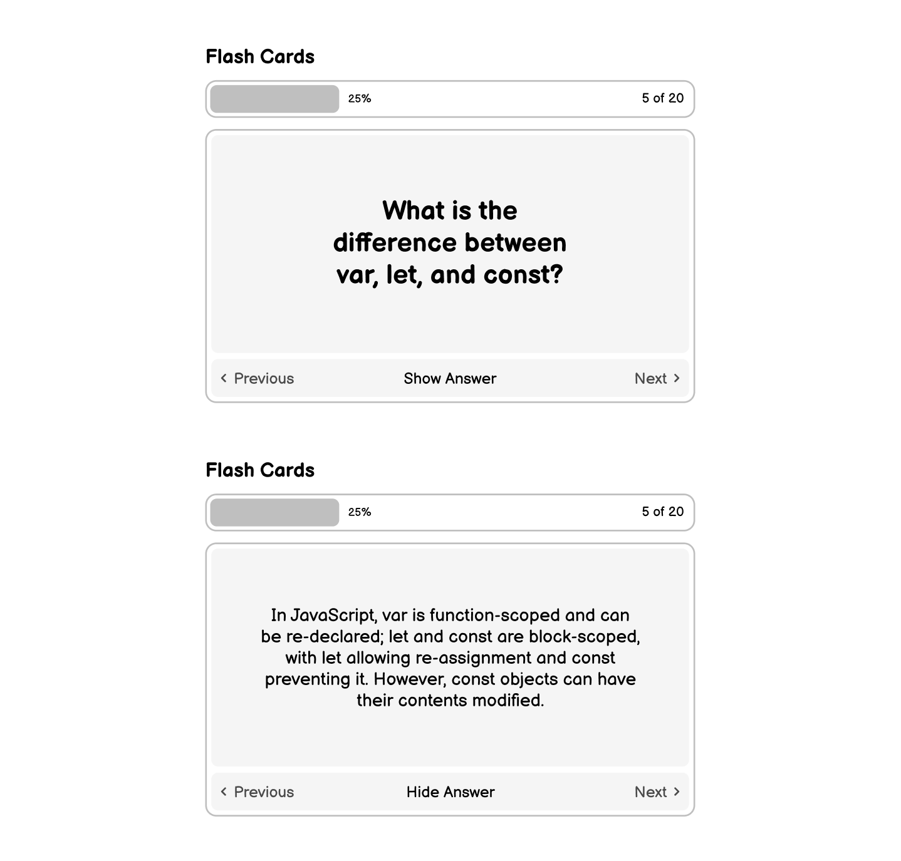

# Flash Cards
**Create a flash card app using JavaScript frameworks.**

The goal of this project is to help you learn about how to use state management and component-based architecture using JavaScript frameworks. You will build a flash card app with pre-defined JavaScript questions and answers that users can flip through to test their knowledge.

## Requirements

You are required to develop a flash cards app with the following features:

+ Pre-defined flashcards with questions and answers
+ Progress bar to show the user’s progress
+ Ability to view flashcards one at a time and flip to reveal the answer
+ Simple navigation to cycle through the flashcards

This project will help you understand how to manage state and create reusable components. You can use any framework of your choice, such as React, Angular, or Vue.js, to build this project.