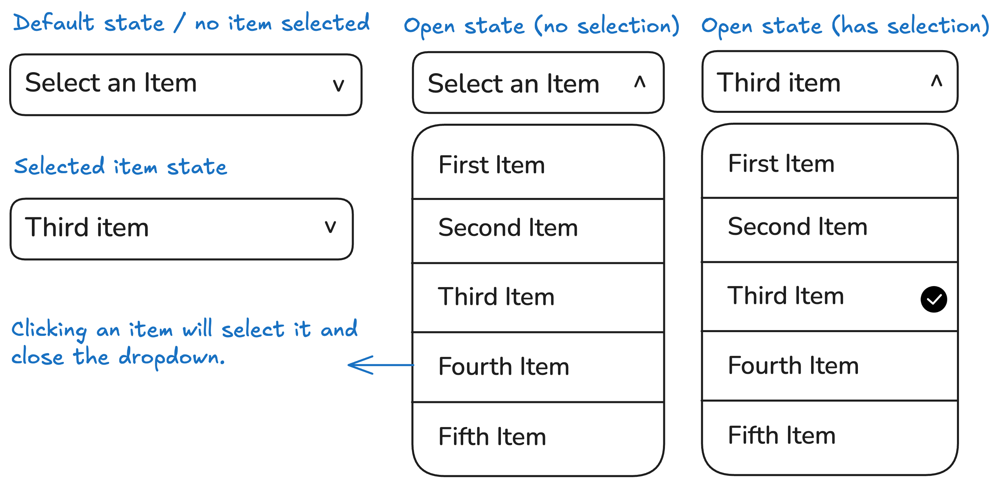

# Custom Dropdown
**Create a custom dropdown using HTML, CSS, and JavaScript.**

You will create a custom dropdown menu that lets users select an item from a list. The dropdown should have a default state showing a placeholder text, an open state revealing all options, and a selected state where the chosen item is displayed. When an item is selected, the dropdown closes, and the selected item is highlighted.

Given below is the mockup showing the dropdown in its default, open, and selected states:

This project will help you practice DOM manipulation, event handling, and creating responsive and interactive elements with JavaScript.